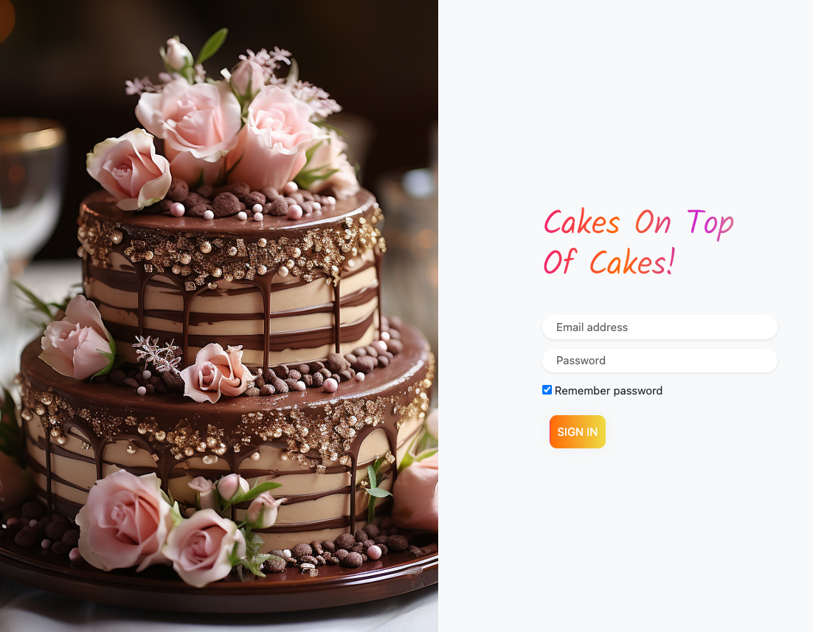
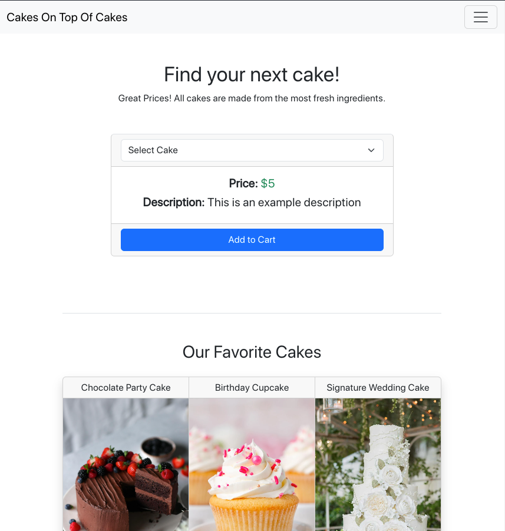

# E-commerce Website

This is an E-commerce website for a cake shop. The website provides information about the services offered by the shop, allows users to sign up, log in, and check out.

## Pages

- [index.html](index.html): The homepage of the website.

- [services.html](services.html): This page provides information about the services offered by the shop.

- [login.html](login.html): This page allows users to log in.
- 

- [signup.html](signup.html): This page allows new users to sign up.

- [checkout.html](checkout.html): This page allows users to check out.
- 

## Styles

The styles for the website are located in the `css/` directory:

- [global.css](css/global.css): Global styles used across all pages.
- [index.css](css/index.css): Styles specific to the homepage.
- [login.css](css/login.css): Styles specific to the login page.
- [style.css](css/style.css): Additional styles used across the website.

## License

This project is licensed under the terms of the license found in the [LICENSE](LICENSE) file.